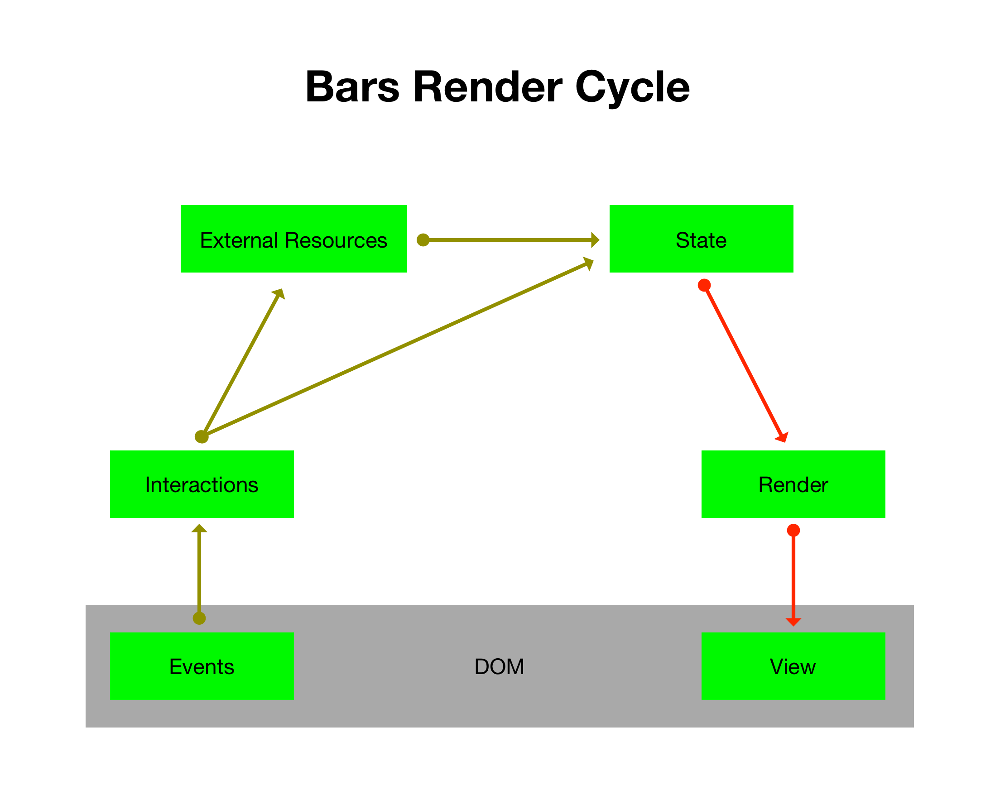

[JavaScript Interface](js-interface.md) | [Bars Language](bars-language.md)

# JavaScript Interface

## Table of Contents

* [App](#app)
    * [App.Bars](#appbars)
    * [Class: App](#class-app)
        * [app.state](#appstate)
        * [app.render()](#apprender)
        * [app.on(events, target, listener)](#apponevents-target-listener)
        * [app.appendTo(element)](#appappendtoelement)
* [Bars](#bars)
    * [Class: Bars](#class-bars)
        * [bars.compile(template)](#barscompiletemplate)
        * [bars.preCompile(template)](#barsprecompiletemplate)
        * [bars.build(compiledTemplate)](#barsbuildcompiledtemplate)
        * [bars.registerBlock(name, func)](#barsregisterblockname-func)
        * [bars.registerPartial(name, builtTemplate)](#barsregisterpartialname-builttemplate)
        * [bars.registerTransform(name, func)](#barsregistertransformname-func)
* [Renderer](#renderer)
    * [Class: Renderer](#class-renderer)
        * [Renderer.text(data[, options])](#renderertextdata-options)
        * [Renderer.update(data)](#rendererupdatedata)
        * [Renderer.appendTo(element)](#rendererappendtoelement)

# App
Bars App is a simple wrapper around Bars that gives you a cleaner interface.  Bars App also gives you a nice way to bind DOM interactions/events to functionality within your app.



## App.Bars
App contains an accessible reference to [Bars](#bars) for your convenience.

## Class: App
* *options* `Object` Options including: template, partials, and transforms.
* *state* `Object` An object which is the App State used to render the App View.

Example:
```javascript
var App = require('bars/app');
/*
 * use require('bars/compiled/app')
 * if your templates are already compiled.
 */

var options = {
    index: mainTemplate,
    partials: {
        name: template
    },
    transforms: {
        name: func
    }
};

var state = {};

var app = new App(options, state);
```

## app.state
App state is an object/structure from which the app view is rendered.

## app.render()
This is the method you would call to update the app view.  After you manipulate the app state you should call this method to update the view.

## app.on(events, target, listener)
* *events* `String` A space separated list of events to listen for.
* *target* `String` A CCS style selector to select the target element.
* *listener* `Function` A listener function that gets call on `events`.

Add event listeners to your app to make it interactive.

Example:
```javascript
app.on('click', '.something', function (evnt, $el) {
    alert('you clicked on something');

    // to access data bound to the target
    // use $el.data('prop-name')

    // if you manipulate part of the app state
    // call app.render()
    // to update the app view.
});
```

## app.appendTo(element)
* *element* `Element` The target element to append the app view to.

Use this method to add the app to the page.

Example:
```javascript
app.appendTo(document.body);
```

# Bars
Bars is a lightweight high performance HTML aware templating engine.  Bars emits DOM rather than DOM-strings, this means the DOM state is preserved even if data updates happen.

## Class: Bars

Example:
```javascript
var Bars = require('bars');
/*
 * use require('bars/compiled')
 * if your templates are already compiled.
 */

var bars = new Bars();
```
## bars.compile(template)
* *template* `String` A Bars template string.

Returns a new [Renderer](#class-renderer) created from the `template`.

This method is equivalent to calling `bars.build(bars.preCompile(template))`.

NOTE: This method is not available in `require('bars/compiled')` variants.
Also see [bars-browserify](https://github.com/Mike96Angelo/Bars-Browserify).

Example:
```javascript
var renderer = bars.compile('<h1>Hello, {{name}}.</h1>');
```

## bars.preCompile(template)
* *template* `String` A Bars template string.

Returns a object structure representing the `template`.

NOTE: This method is not available in `require('bars/compiled')` variants.
Also see [bars-browserify](https://github.com/Mike96Angelo/Bars-Browserify).

Example:
```javascript
var myCompiledTemplate = bars.preCompile('<h1>Hello, {{name}}.</h1>');
```

## bars.build(compiledTemplate)
* *compiledTemplate* `Object` A Bars compiled template.

Returns a new [Renderer](#class-renderer) created from the `compiledTemplate`.

Example:
```javascript
var renderer = bars.build(myComiledTemplate);
```

## bars.registerBlock(name, func)
* *name* `String` The name of the block helper.
* *func* `Function` The block helper function.

Returns *this* [Bars](#bars).

Example:
```javascript
bars.registerBlock('unless',
    function unlessBlock(args, consequent, alternate, context) {
        var condition = args[0];
        if (condition) {
            alternate();
        } else {
            consequent();
        }
    }
);
/*
 * You can supply a new context to either of the consequent or alternate
 * rendering functions by passing in:
 * context.newContext(data, props)
 *
 * data is the new scoped state
 * props is an object who's properties are Block Props
 * accessible in temples through `@<prop-name>`
 */

/**
 * To use the `unless` block in a template
 * use this {{#unless <condition> [<context-map>]}} {{else}} {{/unless}}.
 */
```

## bars.registerPartial(name, template)
* *name* `String` The name of the partial.
* *template* `String|CompiledTemplate` The template for the partial.

Returns *this* [Bars](#bars).

Example:
```javascript
bars.registerPartial('person', 'I am a partial');

/**
 * To use the `person` partial in another
 * template use this {{>person [<expression>] [<context-map>]}}.
 */
```

## bars.registerTransform(name, func)
* *name* `String` The name of the transform helper.
* *func* `Function` The transform helper function.

Returns *this* [Bars](#bars).

Example:
```javascript
bars.registerTransform('upperCase', function upperCase(a) {
    return String(a).toUpperCase();
});

/**
 * To use the `upperCase` transform in a
 * template use this {{@upperCase(<expression>)}}.
 */
```

# Renderer
A renderer is an object that can render/update a DOM view.

## Class: Renderer
* *compiledTemplate* `Object` An object structure containing a pattern for rendering.

## renderer.text(data[, options])
* *data* `Object` Object context for rendering update.
* *options* `Object` Options for indentation.
    * *tabs* `Boolean` Use tabs for indentation.
    * *indent* `Number` Number of spaces to indent with if not using tabs.

Returns DOM-string text.

Renders DOM-string text with `data`.

Example:
```javascript
var renderText = renderer.text({name: 'Bob'}, {tabs: false, indent: 2});
```

## renderer.update(data)
* *data* `Object` Object context for rendering update.

Returns *this* [Renderer](#renderer)

Updates/renders the view with the new `data`.

Example:
```javascript
renderer.update({name: 'Bob'});
```

## renderer.appendTo(element)
* *element*: `Element` The target element to append the app view to.

Returns *this* [Renderer](#class-renderer).

Example:
```javascript
renderer.appendTo(document.body);
```
